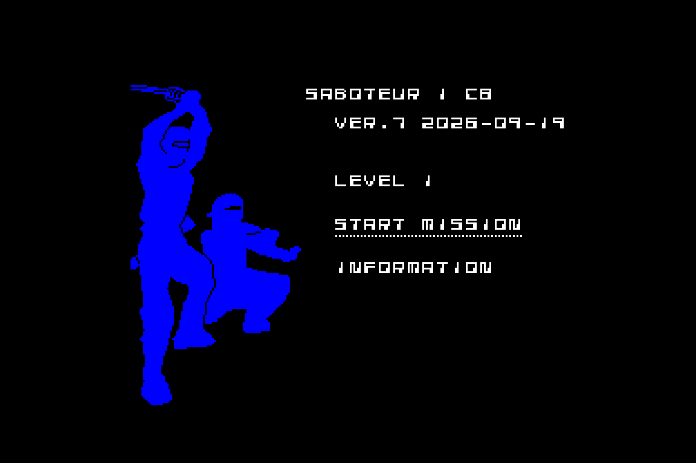
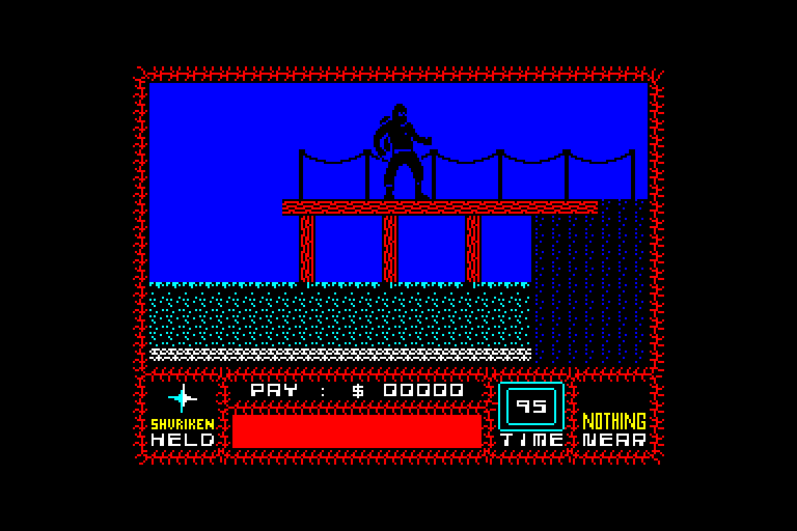

# specialist-saboteur1

Porting Saboteur game from ZX Spectrum to Specialist, based on the Vector-06C port and adapted for Specialist.

### Project Status

Work in Progress.

### Screenshots

 

### Code Structure

 - `sabot0.asm`: loader/bootstrap
 - `sabot1.asm`: main game logic
 - `sabot1in.asm`: initialization data
 - `sabot1it.asm`: items
 - `sabot1ft.asm`: font definition
 - `sabot1rb.asm`: background tiles
 - `sabot1rm.asm`: room structures
 - `sabot1sp1.asm`, `sabot1sp2.asm`: sprites
 - `sabot1t1.asm`, `sabot1t1b.asm`, `sabot1t2.asm`, `sabot1t3.asm`: tiles

### Tools

 - [sjasmplus](https://github.com/z00m128/sjasmplus) cross-compiler (`--i8080` mode)
 - [Salvador](https://github.com/emmanuel-marty/salvador) ZX0 compressor
 - `!compile.cmd` builds BW/C4/C8 color variants and packs them into `.rks` tape images

Emulator of the machine, to test the result:
 - [Emu80](http://emu80.org)

### Credits

Original game by Clive Townsend for ZX Spectrum.
